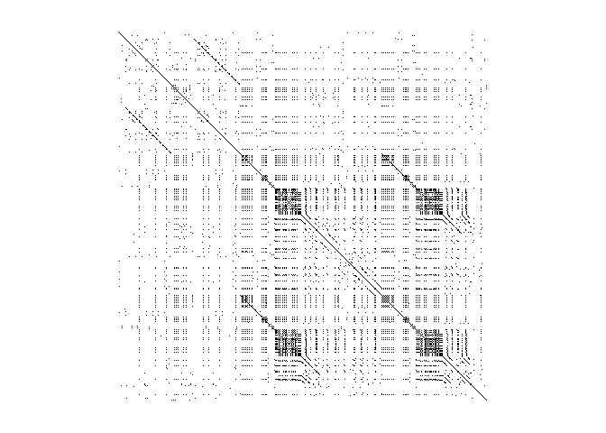
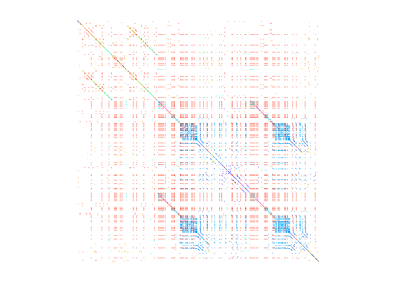

<!-- README.md is generated from README.Rmd. Please edit that file -->
This package holds a single function to calculate and visualize a "songsim" similarity matrix where cell (i, j) is filled if word i in a song's lyrics is the same as word j. This method was first suggested by [Colin Morris](https://colinmorris.github.io/) (see links below).

Install:

``` r
devtools::install_github("gsimchoni/songsim")
```

Load:

``` r
library(songsim)
```

Visualize Beyonce's Formation:

``` r
path <- system.file("extdata", "formation.txt", package = "songsim")
songsim(path)
```



Use `colorfulMode`:

``` r
songsim(path, colorfulMode = TRUE, mainTitle = "Formation - Beyonce")
```



Use `interactiveMode` if you have the `heatmaply` package installed:

``` r
songsim(path, interactiveMode = TRUE, singleColor = "blue")
```

(See live version [here](http://giorasimchoni.com/2017/10/16/2017-10-16-repeat-yourself-the-songsim-package/))

More information and examples [here](http://giorasimchoni.com/2017/10/16/2017-10-16-repeat-yourself-the-songsim-package/).

More information from Colin Morris:

-   A blog post describing interesting "songsims" [here](https://colinmorris.github.io/blog/weird-pop-songs)

-   An interactive React (JS) demo with more examples [here](https://colinmorris.github.io/SongSim/)
